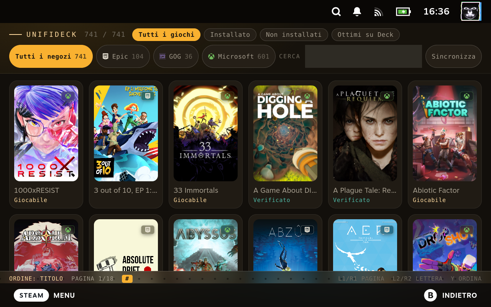
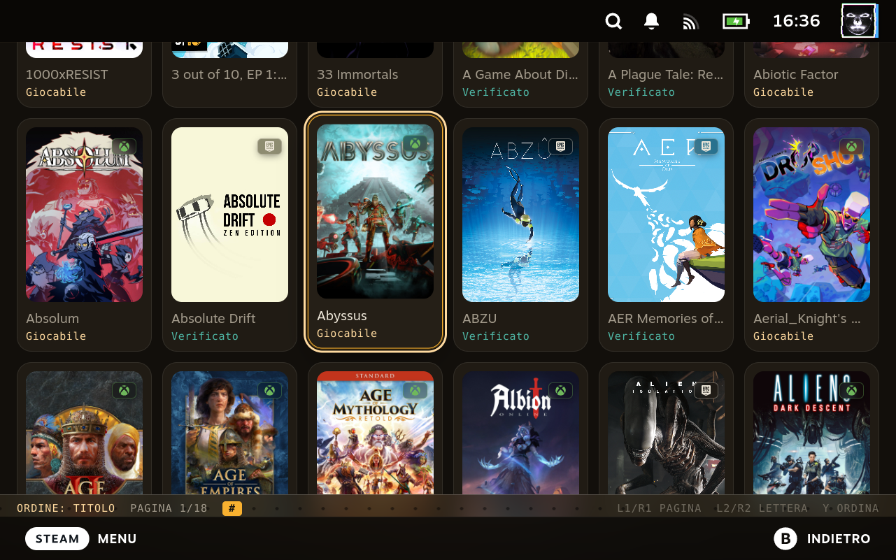
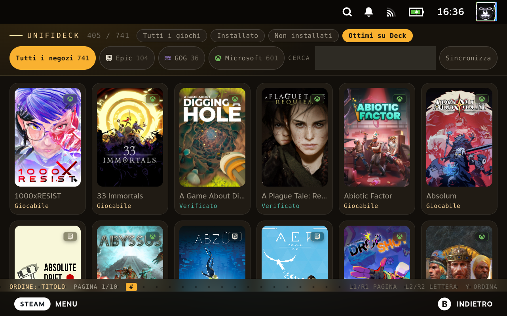

# unideck

**A private fork of [Unifideck](https://github.com/mubaraknumann/unifideck) by [@mubaraknumann](https://github.com/mubaraknumann).**

Unifideck brings games from Epic, GOG, Amazon, Ubisoft and Xbox Cloud Gaming into
Steam on the Steam Deck. All of that — the store integrations, the launcher, the
Proton handling, the cloud saves, the artwork pipeline — is his work. This fork
changes how the library is *browsed*, and fixes a handful of defects found while
doing so.

> **This is not the official project.** If you are looking for Unifideck, go to
> [mubaraknumann/unifideck](https://github.com/mubaraknumann/unifideck). Install
> that one. This fork exists for one Deck, tracks upstream `Release-0.7.3`, and
> is not a distribution.

---

## What this fork changes

Everything in this section is specific to this fork. Everything under
[Upstream documentation](#upstream-documentation) below is Unifideck's own and
is reproduced because it is still accurate.

### A standalone catalogue page

Upstream injects custom tabs into Steam's `/library` view. This fork removes
that injection and registers its own route at `/unifideck`, reached from a
**Library** button in the Quick Access panel. Steam's library — its tab row,
its filtering and sorting — is left exactly as Valve ships it.

*Screenshots below are of this fork.*



The page was rebuilt because the original reused components written for an
injected tab, and those did not survive a 741-game library at full screen: every
game mounted at once (741 tiles and 741 cover images in a single commit), a
native `<select>` and `<input>` that gamepad focus cannot reach, filters that
switched on `onFocus`, and a full re-filter and re-sort on every keystroke.

What it does now:

- **Paginated grid**, 42 tiles a page, so the DOM and the decoded-bitmap
  high-water mark are bounded by construction.
- **Gamepad-native filters** — chips instead of HTML form controls, with
  per-store counts.
- **Cover art** resolved from Steam's own grid store, where sync actually
  writes it.
- **Deck compatibility** on each tile when known (406 of 741 here).
- **Filters remembered** between visits.
- Debounced search, silent refetch after a sync.



Focus is drawn by the page itself, keyed on Steam's `gpfocus` class — the header
retracts as you scroll and returns on any upward movement.



**Controls:** `A` open · `L1`/`R1` page · `L2`/`R2` jump a letter ·
`Y` cycle sort (title, recently played, playtime, size, store).

### Backend fixes

Four defects found in upstream `0.7.3` and fixed here. They are described in
full, with logs and reproduction steps, in [`RAPPORTO-UPSTREAM.html`](RAPPORTO-UPSTREAM.html).

| Fix | Why |
| --- | --- |
| A failed store fetch no longer erases that store's library | A suspend mid-sync made an xCloud request fail four hours later. Every error branch returned `[]`, so the failure arrived as "you own no Xbox games". 603 Steam shortcuts were deleted; the log said `0 errors`. |
| Config schema accepts the `steam` section | The plugin writes `steam.active_user` itself, but the schema forbade it, so it invalidated its own config and booted in degraded mode every time. 11 lines. |
| `SteamBridge` uses an API that exists | `SteamClient.Apps.GetAppOverview` is `undefined` on current Steam; `getAppOverview()` returned `null` for every appid and `isReady()` was always false. |
| The `Game` type matches the wire | The backend dataclass has no `id`, `is_installed` or `cover_image`. Reading them on raw RPC rows yields `undefined` silently — three separate bugs here before it was corrected. |

### Tooling

| Script | What it does |
| --- | --- |
| `./controlla.sh` | Health check: repo vs installed files, plugin log, game/shortcut/registry counts, and a comparison against the previous run so a collapse is noticed immediately. `--test` adds both suites. |
| `./riapplica.sh` | Replays this fork's changes onto a newer upstream release via a real three-way rebase, stopping on conflicts rather than installing a half-merge. |
| `installa-root.sh` | Backs up the installed `dist/`, copies the new build, restarts Decky. |
| `cdp.py`, `perf.py` | Drive Steam's CEF debugger; sample frame pacing while the grid scrolls. |

[`LEGGIMI.md`](LEGGIMI.md) (Italian) documents the Steam integration traps this
cost real time to discover — the two readings of shortcut AppIDs, where cover art
actually lives, `gpfocus` versus DOM focus, the two JS realms, and the 854×534
viewport.

### Building

```bash
pnpm install --ignore-scripts
pnpm run typecheck && pnpm test
pnpm run build
sudo bash installa-root.sh dist
```

---

## Upstream documentation

**Everything in this section describes Unifideck itself and is unchanged from
the original project.** It is kept here because it is still accurate for this
fork — the store integrations, install flow and launcher are untouched.

### Features

- **All your games in one place** — Epic, GOG, Amazon, Ubisoft and Xbox titles
  alongside your Steam library.
- **Install and play like a Steam game** — Install, watch progress, press Play,
  all from Gaming Mode.
- **Install games wherever you like** — internal storage, SD card, or a custom
  folder.
- **Proton handled for you** — a recent Proton is set up automatically; a
  specific version can be forced from Steam's Compatibility menu.
- **Cover art and real game info** — covers, icons, Metacritic scores and Deck
  compatibility ratings.
- **Cloud saves for Epic and GOG** — with a warning when local and cloud copies
  disagree.

### Game details

*This screenshot is from the original project, and still current — this fork does
not change the game page.*


### Prerequisites

- **Decky Loader** installed on the Steam Deck.
- **Microsoft Edge** for store sign-in and Xbox Cloud Gaming; Unifideck prompts
  to install it if missing.
- All other store CLIs and helper tooling ship with the plugin.

### Getting started

*Original instructions, with one difference noted below.*

1. Open the **Quick Access Menu** and launch Unifideck.
2. Connect the stores you want to use.
3. Set your default install location.
4. Run **Sync Libraries** or **Force Sync**.
5. Restart Steam when prompted, so new shortcuts and artwork are applied.
6. For Ubisoft titles bought through Epic, complete the one-time account link at
   [epicgames.com/id/link/ubisoft](https://epicgames.com/id/link/ubisoft).

> **Differs in this fork:** browsing happens on the **Library** button in the
> Quick Access panel, not in Steam's library tabs. Upstream replaces Steam's
> *All Games*, *Installed* and *Great on Deck* tabs; this fork leaves them alone.
> A sync can also be started from the catalogue page itself.

### Known limitations

*From the original project.*

- Steam still needs a restart after sync or cleanup for shortcuts and artwork to
  apply fully.
- Xbox Cloud Gaming is **streaming-only** and depends on Microsoft Edge.
- Cloud saves cover **Epic** and **GOG** only, and game-level support varies.
- Some titles need manual Proton experimentation or store-specific workarounds.
- Proton version and launch options are configured through Steam's native
  shortcut Properties; there is no in-plugin picker.
- For **Ubisoft**, choose the Proton version **before** installing — changing it
  afterwards can invalidate the prefix.
- Not every game has SteamGridDB artwork or complete metadata.

> The upstream limitation about replacing Steam's library tabs, and about
> TabMaster interaction, does not apply here: this fork does not inject tabs.

### Documentation

*All from the original project, in [`docs/`](docs/).*

[FAQ](docs/faq.md) · [Launch Options](docs/launch-options.md) ·
[Proton Compatibility](docs/proton-compatibility.md) ·
[Cloud Saves](docs/cloud-saves.md) · [Microsoft / xCloud](docs/microsoft-xcloud.md) ·
[Architecture](docs/architecture.md) · [Ubisoft Store Spec](docs/ubisoft-store-spec.md) ·
[UI Injection](docs/ui-injection.md)

### Troubleshooting

*From the original project — see the [FAQ](docs/faq.md) for the full list.*

Logs live in `~/.local/var/opt/decky-loader/logs/Unifideck/`. In this fork,
`./controlla.sh` reads them for you and reports anything unusual.

### Languages

*From the original project.* English, Italian, German, Spanish, French, Dutch,
Polish, Portuguese (BR), Russian, Turkish, Ukrainian, Arabic, Japanese, Korean,
Chinese (Simplified and Traditional). Strings added by this fork are translated
in English and Italian, and fall back to English elsewhere.

### Tech stack

*From the original project.* TypeScript + React on `@decky/ui`, Python backend
on a five-layer architecture with an EventBus and service DI, vitest and pytest.

---

## Credits

**Unifideck is created and maintained by [@mubaraknumann](https://github.com/mubaraknumann).**
This fork is a set of changes on top of his work; the plugin, its architecture
and everything it does with the stores are his. If you find it useful, support
the original project:
[GitHub Sponsors](https://github.com/sponsors/mubaraknumann) ·
[Ko-fi](https://ko-fi.com/mubaraknumann).

The original project's own credits, preserved:

- **Platform and UI** — [Decky Loader](https://github.com/SteamDeckHomebrew/decky-loader),
  `@decky/api`, `@decky/ui`, and the SteamDeckHomebrew community
- **Store and runtime tooling** — [legendary](https://github.com/derrod/legendary),
  gogdl, [nile](https://github.com/imLinguin/nile), [comet](https://github.com/imLinguin/comet),
  [winetricks](https://github.com/Winetricks/winetricks),
  [umu-launcher](https://github.com/Open-Wine-Components/umu-launcher),
  and [SteamGridDB](https://www.steamgriddb.com/)
- **Reference projects and patterns** — [TabMaster](https://github.com/Tormak9970/TabMaster),
  [SteamGridDB Decky](https://github.com/SteamGridDB/decky-steamgriddb),
  [ProtonDB Decky](https://github.com/OMGDuke/protondb-decky),
  [Heroic Games Launcher](https://github.com/Heroic-Games-Launcher/HeroicGamesLauncher),
  and [Junk-Store](https://github.com/ebenbruyns/junkstore)
- **Special thanks** — @src893, @xXJSONDeruloXx, @moi952, @Lazer-zx5, @buddax2,
  @Grails125, @clach04, @kevbenjam, @kmturley, DeckWizard, sufi0511, \_badbug,
  lutianxing, u/EnTei7K, u/IN50MNIAC, derrod, and the Discord testers.

The visual language of the catalogue page is adapted from
[rackdroid.org](https://rackdroid.org).

## License

GPL-3.0-or-later, inherited from the original project. See [LICENSE](LICENSE).

## Disclaimer

Not affiliated with Valve, Epic Games, GOG, Amazon, Ubisoft or Microsoft. All
trademarks belong to their respective owners. This is an unofficial fork of an
unofficial plugin; use at your own risk.
