# Microsoft / Xbox Cloud Gaming — Technical Documentation

## Table of contents

- [Overview](#overview)
  - [What it brings to the plugin](#what-it-brings-to-the-plugin)
- [Architecture](#architecture)
  - [Files and responsibilities](#files-and-responsibilities)
  - [Module diagram](#module-diagram)
  - [User journey (state machine)](#user-journey-state-machine)
  - [Use cases](#use-cases)
- [Authentication flow](#authentication-flow)
  - [Full sequence](#full-sequence)
  - [Token chain](#token-chain)
  - [Token chain technical details](#token-chain-technical-details)
  - [Token lifecycle](#token-lifecycle)
  - [Chromium installation](#chromium-installation)
- [Catalog synchronization](#catalog-synchronization)
  - [Sync flow](#sync-flow)
  - [games.map format](#gamesmap-format)
- [Launching an xCloud game](#launching-an-xcloud-game)
  - [Launch flow](#launch-flow)
  - [Chromium flags for xCloud](#chromium-flags-for-xcloud)
  - [Shared Chromium profile](#shared-chromium-profile)
- [Virtual keyboard](#virtual-keyboard)
  - [Injection and locale detection](#injection-and-locale-detection)
  - [Available layouts](#available-layouts)
  - [Visual design](#visual-design)
- [Steam Deck environment](#steam-deck-environment)
  - [Environment variables](#environment-variables-injected-by-clean_env)
  - [XAUTHORITY detection](#xauthority-detection)
- [Cookie management and logout](#cookie-management-and-logout)
  - [Bidirectional logout](#bidirectional-logout)
  - [Shared Chromium profile](#shared-chromium-profile-1)
  - [Reading cookies](#reading-cookies-without-blocking-chromium)
- [User interface (Frontend)](#user-interface-frontend)
  - ["Play on Cloud" button](#play-on-cloud-button)
  - [Connecting from the QAM](#connecting-from-the-qam)
- [Error handling](#error-handling)
- [Prerequisites and dependencies](#prerequisites-and-dependencies)
- [Configuration](#configuration)
- [Internationalization](#internationalization)
- [Security](#security)
- [Known limitations](#known-limitations)

---

## Overview

The Microsoft integration allows Steam Deck users to **play over 500 Xbox Cloud Gaming (xCloud) titles** directly from their Steam library, through the Unifideck plugin. Games are streamed from Microsoft servers — no local installation is required.

This feature turns the Steam Deck into a portable Xbox console by seamlessly integrating Game Pass titles into the Steam interface.

### What it brings to the plugin

- **Access to ~500+ games** from the xCloud catalog without downloading
- **Unified authentication**: Microsoft sign-in from Steam's QAM (Quick Access Menu)
- **Native launch**: xCloud games appear in the Steam library as shortcuts, with artwork and a "Play on Cloud" button
- **Virtual keyboard** (AZERTY/QWERTY) built-in for the touchscreen authentication screen
- **Bidirectional logout sync** between the plugin and xbox.com

---

## Architecture

### Files and responsibilities

The Microsoft integration is split into single-responsibility specialized modules. The main connector orchestrates authentication and synchronization, while browser management, HTTP calls, CDP interception, and the virtual keyboard are isolated in their own files. This separation makes debugging, unit testing, and independent evolution of each component easier.

The integration is now a package under `stores/microsoft/` (it was a set of flat `stores/microsoft_*.py` modules before the 0.7 refactor).

| File                                              | Role                                                       |
| ------------------------------------------------- | ---------------------------------------------------------- |
| `stores/microsoft/microsoft_store.py`             | Main connector: auth orchestration, tokens, catalog        |
| `stores/microsoft/microsoft_auth.py`              | HTTP helpers, XBL/XSTS token chain                         |
| `stores/microsoft/microsoft_browser_auth.py`      | Browser-based OAuth capture (CEF 8080 / Edge 9222 fallback)|
| `stores/microsoft/microsoft_catalog.py`           | Game + xCloud catalog (displaycatalog)                     |
| `stores/microsoft/microsoft_subscription.py`      | Game Pass subscription state                               |
| `stores/microsoft/tokens/`                        | Token manager, OAuth, XBL chain, persistence               |
| `auth/edge_browser/`                              | Chromium/Edge install + launch + profile management        |
| `compatibility/library.py`                        | `inject_virtual_keyboard` (CDP)                            |
| `bin/unifideck-launcher`                          | xCloud launch                                              |
| `src/components/play/XCloudButtons.tsx`           | "Play on Cloud" button (rendered by `PlaySectionWrapper`)  |
| `src/components/modals/ChromiumInstallModal.tsx`  | Chromium install modal                                     |
| `src/components/settings/StoreConnections.tsx`    | Microsoft connection panel                                 |

### Module diagram

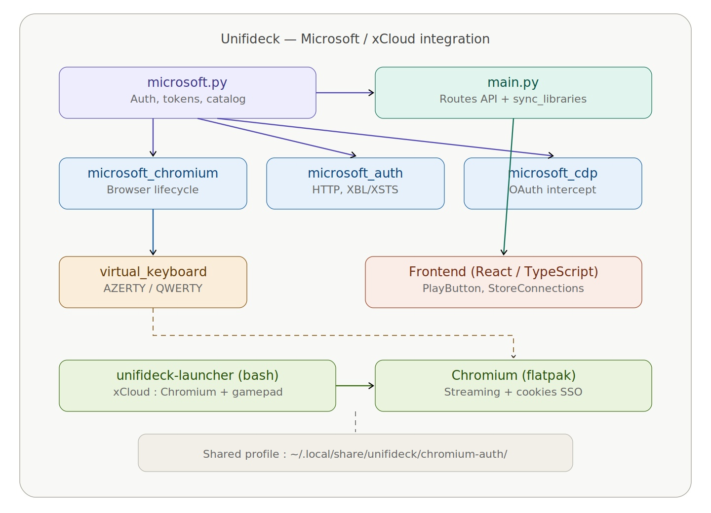

### User journey (state machine)

The following diagram represents all possible interface states from the user's perspective. Each transition corresponds to a user action or system event (success, failure, timeout). Error paths systematically return to the initial state.

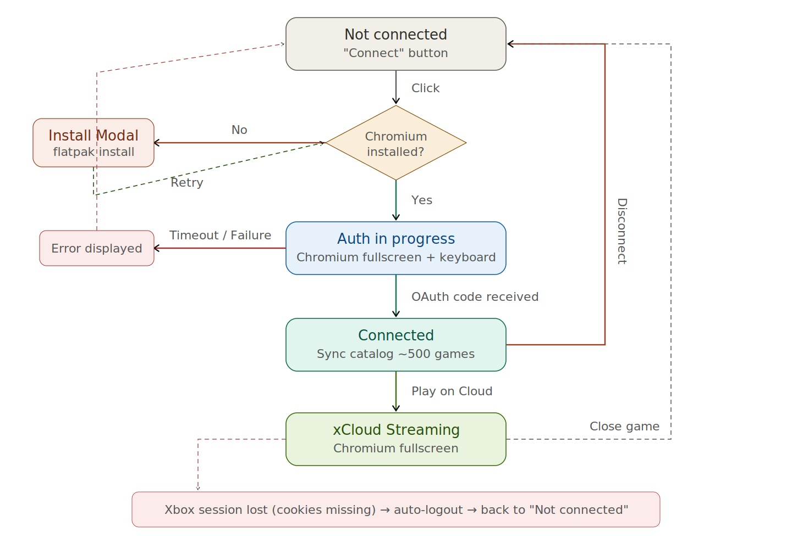

### Use cases

The following diagram identifies all available actions for a user of the Microsoft integration. Primary use cases (in blue) are directly triggered by the user. Included and extended cases (in gray) are automatic or conditional steps. `<<include>>` relations indicate mandatory steps, while `<<extend>>` signals behaviors triggered only under certain conditions (Chromium missing, session expired).

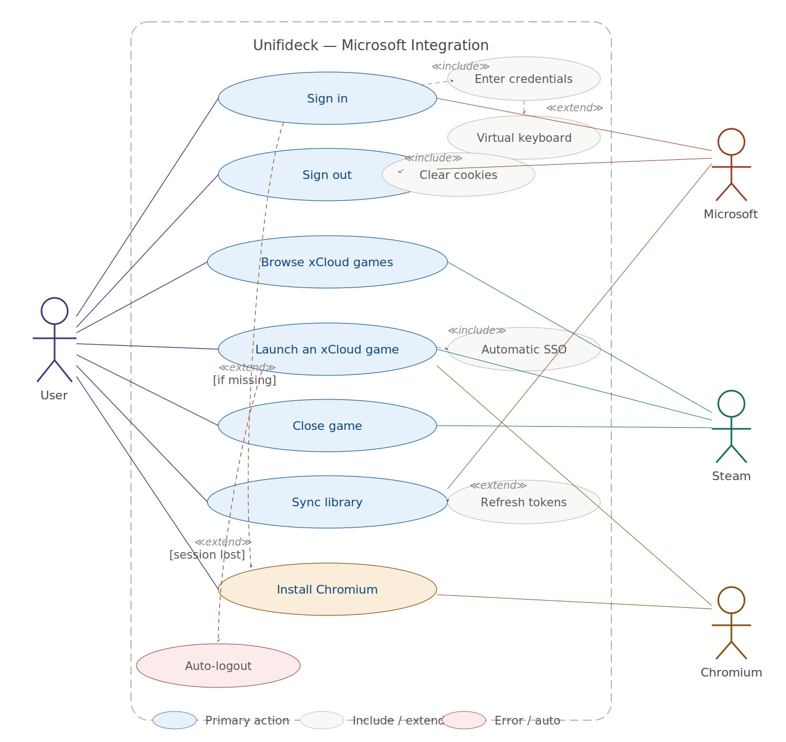

---

## Authentication flow

Authentication uses **Microsoft OAuth 2.0** with authorization code interception via the **Chrome DevTools Protocol (CDP)**. Chromium is launched outside of Steam so that cookies persist between sessions.

### Full sequence

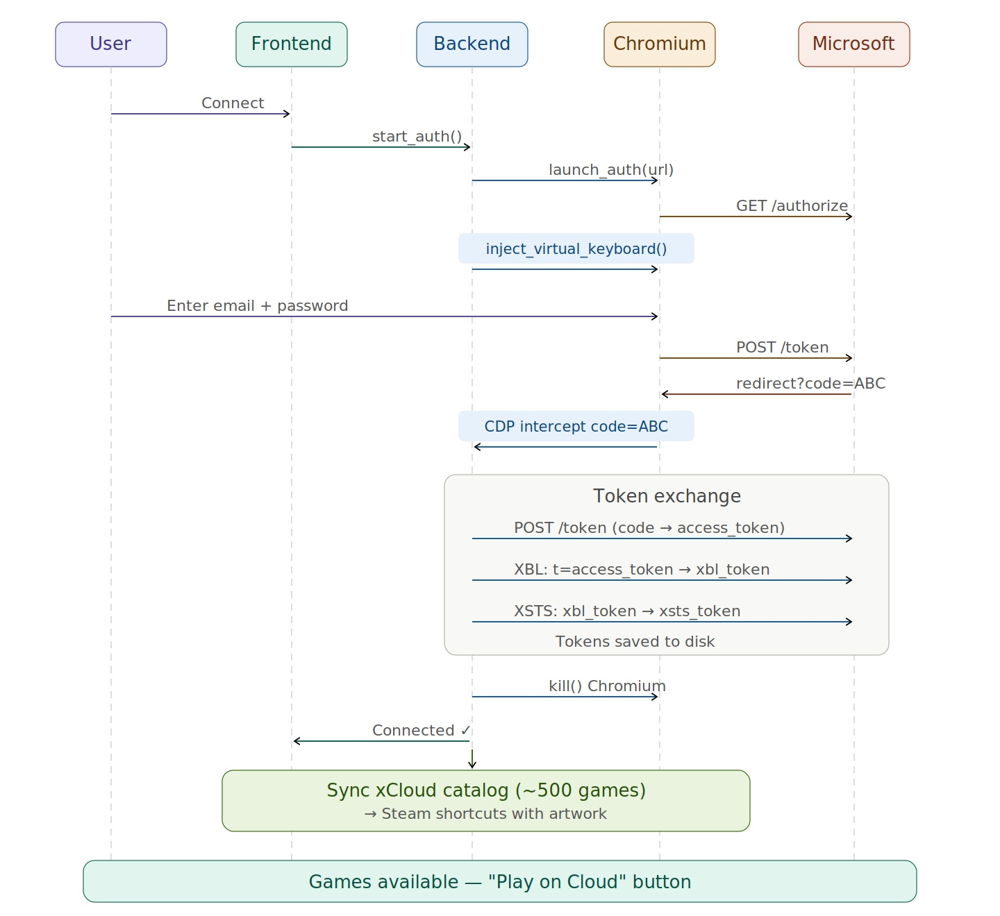

### Token chain

After obtaining the OAuth code, the backend builds a token chain to access Xbox APIs:

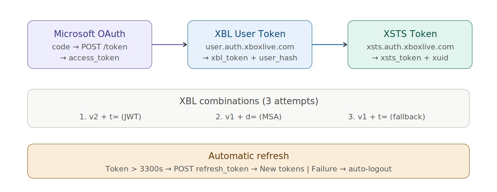

### Token chain technical details

The `RpsTicket` prefix (`d=` vs `t=`) depends on the token format:

- `t=` is correct for JWT OAuth2 tokens
- `d=` is for legacy compact tickets

`x-xbl-contract-version: "2"` is required with the `t=` prefix for the XBL flow to succeed.

### Token lifecycle

Microsoft tokens have a limited lifespan (~1 hour for the access token). The plugin automatically manages their renewal transparently for the user. On every API call (sync, status check), `_ensure_fresh_ms_token()` checks the token's age: if it is nearing expiration, a refresh is triggered using the `refresh_token` persisted on disk. If the refresh fails (token revoked, account modified), the plugin performs an automatic logout and requests a new authentication.

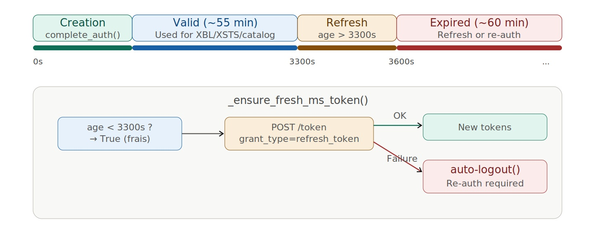

### Chromium installation

When Chromium is not detected on the system, the backend returns `needs_chromium: true` to the frontend. The `ChromiumInstallModal` then offers the user to install Chromium automatically via flatpak. Once installation is complete, auth is relaunched without further user intervention.

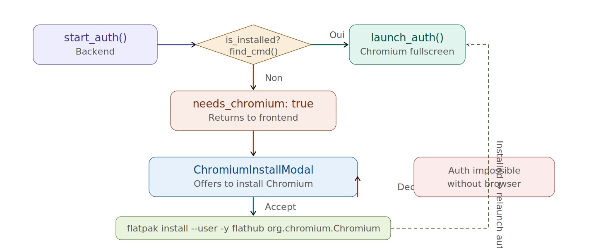

---

## Catalog synchronization

Synchronization retrieves the full list of available xCloud games and adds them to the Steam library.

### Sync flow

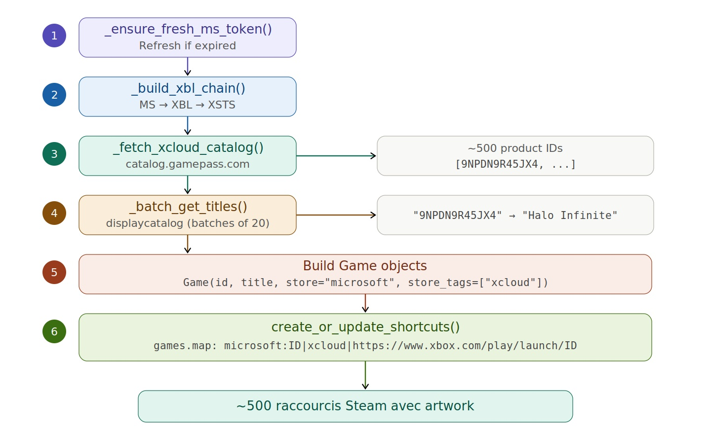

### games.map format

```
microsoft:{productId}|xcloud|{full_url}
```

Example:

```
microsoft:9NPDN9R45JX4|xcloud|https://www.xbox.com/play/launch/9NPDN9R45JX4
```

The launcher reads this entry to determine that it is an xCloud game and open Chromium.

---

## Launching an xCloud game

### Launch flow

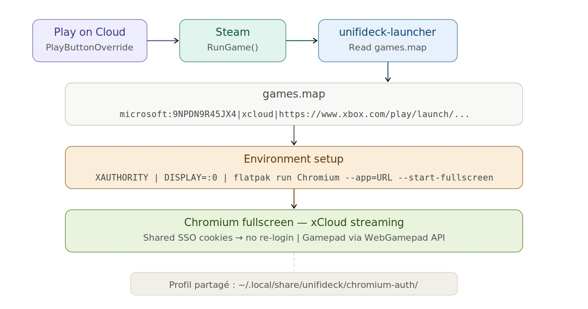

### Chromium flags for xCloud

| Flag                                         | Purpose                                |
| -------------------------------------------- | -------------------------------------- |
| `--app=URL`                                  | App mode: no address bar or tabs       |
| `--start-fullscreen`                         | Fullscreen (no window borders)         |
| `--user-data-dir=chromium-auth/`             | Shared profile with auth → SSO cookies |
| `--enable-gamepad-button-axis-events`        | Steam Deck controller support          |
| `--enable-features=WebGamepad`               | Web Gamepad API enabled                |
| `--autoplay-policy=no-user-gesture-required` | Automatic video playback               |
| `--disable-dev-shm-usage`                    | Shared memory compatibility            |
| `--password-store=basic`                     | Prevents KWallet/GNOME Keyring popups  |

### Shared Chromium profile

The same directory `~/.local/share/unifideck/chromium-auth/` is used for:

1. **Authentication** — Microsoft cookies are created here
2. **Game launch** — Chromium reuses these cookies for xbox.com SSO

This avoids double authentication.

### Controller support (Steam Deck)

xCloud controller input **works in Gaming Mode** (the supported target). It does
**not** work in Desktop Mode — that is a known, out-of-scope limitation.

What actually makes the Deck controller drive a streamed game:

- **Microsoft Edge is required.** Microsoft's Steam Deck controller fix for cloud
  gaming is **Edge-only** — Chrome/Chromium do not get it. (This is why the plugin
  hard-requires the Edge flatpak.)
- **The xCloud shortcut needs a *gamepad* Steam Input layout.** Steam's default for
  these shortcuts (`Gamepad with Mouse Trackpad`) already works. The plugin
  best-effort defaults it to **`Gamepad With Joystick Trackpad`**
  (`controller_neptune_gamepad_fps.vdf`) via
  `controllerConfig.ts::ensureGamepadConfigForApp` → `SetSelectedConfigForApp`,
  applied **after** `RunGame` (Steam's controller-config API is inert for an idle
  shortcut, so it is set once the app is the active launch target; the selection
  persists). If the auto-default doesn't take, set it manually once via
  **gear → Controller Layout → Templates → Gamepad With Joystick Trackpad** — it
  persists in Steam Cloud.
- **udev metadata override.** `EdgeInstaller.ensure_controller_permissions` applies
  `flatpak --user override --filesystem=/run/udev:ro com.microsoft.Edge` so Edge's
  Gamepad API can identify the pad. No `--device=all` flag is needed: the Edge
  flatpak's manifest already grants `devices=all` by default (verified via
  `flatpak info -m com.microsoft.Edge`).

Approaches that were tried and found **unnecessary** (do not re-add): a synthetic
`evdev` button-injection "trigger" (it produced a *false* gamepad detection that
masked the real layout issue), a runtime `--device=all` flag (redundant — see
above), and the controller-layout "bounce" via the Configurator popup (staging
disabled it as counterproductive). The real lever is simply the gamepad Steam
Input layout above.

---

## Virtual keyboard

The Steam Deck has no physical keyboard. Steam's overlay keyboard is not available because Chromium is launched outside of Steam. The solution: a **virtual keyboard injected via CDP**.

### Injection and locale detection

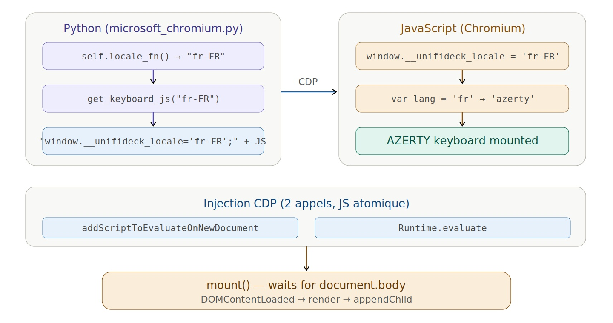

### Available layouts

Two layouts are supported, automatically selected based on the locale:

- **AZERTY** for `fr-*` locales
- **QWERTY** for all other locales

### Visual design

The keyboard uses a Steam-like aesthetic:

- Translucent background with `backdrop-filter: blur(20px)`
- Keys with gradient and subtle inner shadow
- Slide-up animation on focus (`transform: translateY`)
- Touch feedback: scale 0.94 on press
- SVG icons for Shift, Backspace, Enter
- Blue Enter key (Steam accent color)
- AZERTY/QWERTY badge in the bottom right corner

---

## Steam Deck environment

The plugin runs inside **PluginLoader** (a systemd service) which has no graphical environment. Launching Chromium requires injecting the missing environment variables.

### Environment variables injected by `clean_env()`

| Variable                   | Value                           | Reason                               |
| -------------------------- | ------------------------------- | ------------------------------------ |
| `DISPLAY`                  | `:0`                            | X11 session                          |
| `XDG_RUNTIME_DIR`          | `/run/user/1000`                | Bus socket                           |
| `DBUS_SESSION_BUS_ADDRESS` | `unix:path=/run/user/1000/bus`  | D-Bus                                |
| `XAUTHORITY`               | `/run/user/1000/xauth_*` (glob) | X11 auth (randomly named on SteamOS) |
| `GTK_MODULES`              | `""`                            | Suppress canberra warnings           |

### XAUTHORITY detection

SteamOS uses a randomly named xauth file. Detection is done via glob:

```python
xauth_files = glob.glob(f"/run/user/{uid}/xauth_*")
# → ["/run/user/1000/xauth_TVSUbt"]
```

---

## Cookie management and logout

Connecting and disconnecting from the Microsoft account is done **once**, from the Unifideck plugin user interface (QAM → Microsoft → Connect). Once authenticated, the user does not need to sign in again — session cookies persist in the shared Chromium profile and are automatically reused on every game launch. Disconnection is also done from the plugin, and propagates to the browser cookies.

### Bidirectional logout

The plugin maintains consistency between its own authentication state (OAuth tokens stored on disk) and the session state in the Chromium browser (xbox.com cookies). If the user logs out from either side, both are synchronized automatically: a logout from the plugin clears Chromium cookies, and an expired session in the browser triggers an auto-logout on the plugin side.

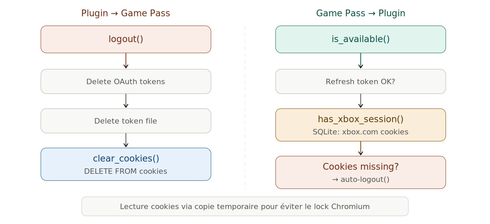

### Shared Chromium profile

The directory `~/.local/share/unifideck/chromium-auth/` is the central point for session persistence. It stores the Microsoft cookies created during authentication and makes them available to the launcher for xbox.com SSO at streaming time. This profile is also checked by the plugin to detect if the user logged out from the Game Pass page, and cleaned up during an explicit logout.

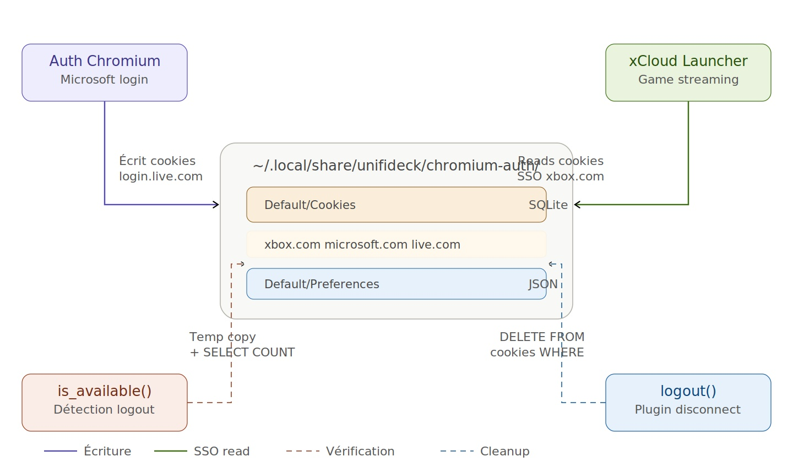

### Reading cookies (without blocking Chromium)

Chromium locks its SQLite database. Reading is done via a temporary copy:

```python
shutil.copy2(cookie_db, tmp_path)  # atomic copy
conn = sqlite3.connect(tmp_path)    # read without lock
cursor = conn.execute(
    "SELECT COUNT(*) FROM cookies WHERE host_key LIKE '%xbox.com%'"
)
```

---

## User interface (Frontend)

### "Play on Cloud" button

When a game has the `store_tags: ["xcloud"]` tag, `XCloudButtons` (rendered by `PlaySectionWrapper`) displays a special button:

| State         | Display                                                      |
| ------------- | ------------------------------------------------------------ |
| Connected     | **▶ Play on Cloud** (blue, clickable)                        |
| Not connected | **Sign in to play** (grayed out, `opacity: 0.4`, `disabled`) |

Clicking triggers `SteamClient.Apps.RunGame()` which launches `unifideck-launcher` with `LaunchOptions: microsoft:{productId}`.

### Connecting from the QAM

The `StoreConnections` panel in Steam's Quick Access Menu presents three distinct states. The interface adapts in real time to the connection state, periodically checked by the frontend via `check_store_status`.

---

## Error handling

Every failure point is covered by a detection and recovery mechanism. The plugin never stays in a stuck state: errors bring the user back to a stable state (QAM with "Connect" button) from which they can retry the operation.

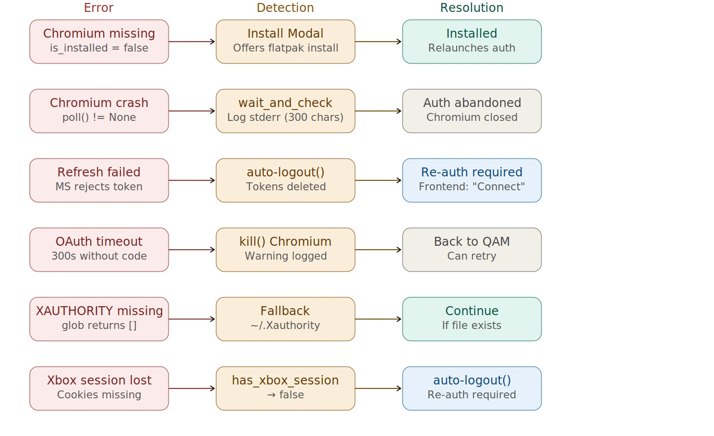

---

## Prerequisites and dependencies

The Microsoft integration requires the following, automatically verified by the plugin:

| Prerequisite                     | Verification                                     | Fallback                             |
| -------------------------------- | ------------------------------------------------ | ------------------------------------ |
| **Chromium** (flatpak or native) | `find_cmd()` tests --user and --system           | `ChromiumInstallModal` offered       |
| **websockets** (Python)          | `import websockets` in `inject_virtual_keyboard` | Keyboard not injected (non-blocking) |
| **Internet connection**          | Implicit (Microsoft API calls)                   | HTTP errors logged                   |
| **Game Pass subscription**       | Verified by xbox.com at launch                   | "Subscribe" page displayed           |
| **flatpak** (for installation)   | `shutil.which("flatpak")`                        | `flatpakNotFound` error              |
| **X11 session** (DISPLAY)        | `clean_env()` injects `:0`                       | Chromium won't open                  |

The plugin is designed to work without manual intervention: if a prerequisite is missing, the interface guides the user toward resolution (Chromium installation, re-connection).

---

## Configuration

All endpoints and parameters are read from `settings.json` (not hardcoded):

| Key                    | Usage                                     |
| ---------------------- | ----------------------------------------- |
| `client_id`            | Microsoft OAuth application ID            |
| `auth_url`             | OAuth authorize endpoint                  |
| `token_url`            | OAuth token endpoint                      |
| `redirect_uri`         | OAuth redirect URI                        |
| `scope`                | `Xboxlive.signin Xboxlive.offline_access` |
| `xbl_auth_url`         | XBL user token endpoint                   |
| `xsts_url`             | XSTS token endpoint                       |
| `product_url`          | Display catalog API                       |
| `gamepass_catalog_url` | Game Pass catalog                         |
| `xcloud_catalog_id`    | xCloud catalog ID                         |
| `token_file`           | Token file path                           |

---

## Internationalization

### OAuth

The `ui_locales` parameter is added to the OAuth URL so that the Microsoft page displays in the user's language:

```
/authorize?...&ui_locales=en-EN
```

### Virtual keyboard

The layout (AZERTY/QWERTY) is selected based on the Unifideck locale:

- `fr-*` → AZERTY
- All others → QWERTY

---

## Security

- OAuth tokens are stored locally in a file (path configurable via `settings.json`)
- The `refresh_token` is the only persisted secret; the `access_token` expires after ~1h
- Chromium cookies are in a dedicated profile (`chromium-auth/`)
- The `client_id` is public (registered Microsoft application)
- No server secret is needed (public client OAuth flow)
- `LD_LIBRARY_PATH` and `LD_PRELOAD` are cleaned to prevent injections via PluginLoader

---

## Known limitations

1. **Streaming only** — no games are downloaded or installed locally
2. **Game Pass subscription required** — verified server-side (xbox.com) at launch
3. **Requires Chromium** — installed via flatpak if missing
4. **Network quality** — streaming depends on Internet connection
5. **Controller works in Gaming Mode only** — input flows via Edge's Gamepad API and requires a *gamepad* Steam Input layout on the shortcut (see [Controller support (Steam Deck)](#controller-support-steam-deck)). Desktop Mode is unsupported.
